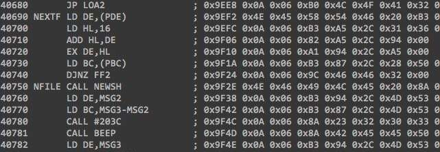

=====================================
Tools to manipulate ZX Spectrum files
=====================================

.. image:: https://travis-ci.org/codeatcpp/zxtools.svg?branch=master
   :target: https://travis-ci.org/codeatcpp/zxtools

.. image:: https://codecov.io/gh/codeatcpp/zxtools/branch/master/graph/badge.svg
   :target: https://codecov.io/gh/codeatcpp/zxtools    

Here's a set of utils to manipulate files that were copied from a TR-DOS diskette or from a tape.

Originally the tools were written to simplify the following workflow:

1. Grab diskette image using `Hobeta <http://speccy.info/Hobeta>`_ tool.
2. Strip the file header and save the result to a new file.
3. Convert resulting `Zeus Z80 assembler <https://en.wikipedia.org/wiki/Zeus_Assembler>`_ file to the plain text format.

TODO: I have future plans to implement some more tools I need to restore my old ZX Spectrum projects.

But you can use them in the way you need. And it's very easy to use: download the package, run ``setup.py`` (or install via ``pip install zxtools``), invoke in the following way::

   $ python3 -m zxtools.hobeta strip input.hobeta result.zeus
   $ python3 -m zxtools.zeus2txt result.zeus listing.txt --include-code

NOTE: Python 3 is required to use this package, and Python 2 is not supported but you are welcome to fix it.

